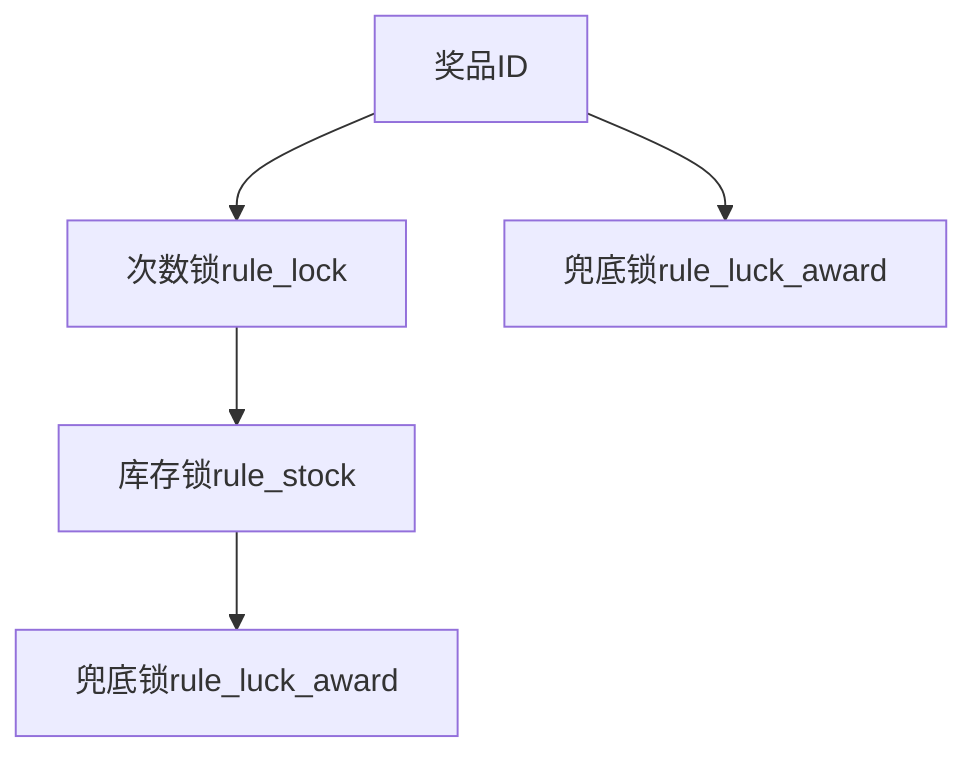

# 抽奖规则树模型实现
* 抽奖前的规则逻辑是责任链模式（一条道走到底，拦截后 后续规则不再执行），抽奖中/后过滤则需要按树结构进行过滤（多个分叉路口，拦截后 后续规则还要执行(兜底)）

* 1.Vo的创建，二叉树实体RuleTreeVO、二叉树节点RuleTreeNodeVO、二叉树节点分支RuleTreeNodeLineVO、分支连接规则枚举RuleLimitTypeVO


* 2.树接口和对应的三个实现类(接口+实现)：rule_lock、rule_luck_award、rule_stock（后续从数据库查出数据进行校验决定是否放行）
```
@Slf4j
@Component("rule_lock")
public class RuleLockLogicTreeNode implements ILogicTreeNode {
    @Override
    public DefaultTreeFactory.TreeActionEntity logic(String userId, Long strategyId, Integer awardId) {
        log.info("次数锁节点 userId:{} strategyId:{} awardId:{}", userId, strategyId, awardId);

        // 次数锁默认放行
        return DefaultTreeFactory.TreeActionEntity.builder()
                .ruleLogicCheckType(RuleLogicCheckTypeVO.ALLOW)
                .build();
    }
}
```
```
@Slf4j
@Component("rule_luck_award")
public class RuleLuckAwardLogicTreeNode implements ILogicTreeNode {


    @Override
    public DefaultTreeFactory.TreeActionEntity logic(String userId, Long strategyId, Integer awardId) {
        log.info("兜底奖励节点 userId:{} strategyId:{} awardId:{}", userId, strategyId, awardId);
        // 兜底奖励默认拦截：返回奖品id101
        return DefaultTreeFactory.TreeActionEntity.builder()
                .ruleLogicCheckType(RuleLogicCheckTypeVO.TAKE_OVER)
                .strategyAwardData(DefaultTreeFactory.StrategyAwardData.builder()
                        .awardId(101)
                        .awardRuleValue("1,100")
                        .build())
                .build();
    }
}
```
```
@Slf4j
@Component("rule_stock")
public class RuleStockLogicTreeNode implements ILogicTreeNode {
    @Override
    public DefaultTreeFactory.TreeActionEntity logic(String userId, Long strategyId, Integer awardId) {
        log.info("库存扣减节点 userId:{} strategyId:{} awardId:{}", userId, strategyId, awardId);

        return DefaultTreeFactory.TreeActionEntity.builder()
                .ruleLogicCheckType(RuleLogicCheckTypeVO.TAKE_OVER)
                .build();
    }
}
```
* 3.规则树的创建工厂（两个内部类方便标识决策树动作和抽奖规则数据）：这里是使用的引擎对树进行处理，后续我们可以定制自己的引擎 来更换实现
```
@Service
public class DefaultTreeFactory {

    private final Map<String, ILogicTreeNode> logicTreeNodeMap;

    public DefaultTreeFactory(Map<String, ILogicTreeNode> logicTreeNodeMap) {
        this.logicTreeNodeMap = logicTreeNodeMap;
    }

    public IDecisionTreeEngine openLogicTree(RuleTreeVO ruleTreeVO){
        return new DescisionTreeEngine(logicTreeNodeMap, ruleTreeVO);
    }

    @Data
    @Builder
    @AllArgsConstructor
    @NoArgsConstructor
    public static class TreeActionEntity{
        private RuleLogicCheckTypeVO ruleLogicCheckType;
        private StrategyAwardData strategyAwardData;
    }

    @Data
    @Builder
    @AllArgsConstructor
    @NoArgsConstructor
    public static class StrategyAwardData{
        /*抽奖奖品ID*/
        private Integer awardId;
        /*抽奖奖品规则*/
        private String awardRuleValue;
    }

}
```

* 4.规则引擎实现(接口 + 实现)：对树进行遍历处理 得到最终结果数据
```
@Slf4j
public class DescisionTreeEngine implements IDecisionTreeEngine {

    private final Map<String, ILogicTreeNode> logicTreeNodeMap;

    private final RuleTreeVO ruleTreeVO;

    public DescisionTreeEngine(Map<String, ILogicTreeNode> logicTreeNodeMap, RuleTreeVO ruleTreeVO) {
        this.logicTreeNodeMap = logicTreeNodeMap;
        this.ruleTreeVO = ruleTreeVO;
    }

    @Override
    public DefaultTreeFactory.StrategyAwardData process(String userId, Long strategyId, Integer awardId) {
        DefaultTreeFactory.StrategyAwardData strategyAwardData = null;
        // 获取基础信息（根节点、节点集合）
        String nextNode = ruleTreeVO.getTreeRootRuleNode();
        Map<String, RuleTreeNodeVO> treeNodeMap = ruleTreeVO.getTreeNodeMap();

        // 获取当前操作节点（根节点）
        RuleTreeNodeVO ruleTreeNode = treeNodeMap.get(nextNode);

        // 循环决策树节点
        while (nextNode != null){
            ILogicTreeNode logicTreeNode = logicTreeNodeMap.get(ruleTreeNode.getRuleKey());

            DefaultTreeFactory.TreeActionEntity logicEntity = logicTreeNode.logic(userId, strategyId, awardId);
            RuleLogicCheckTypeVO ruleLogicCheckTypeVo = logicEntity.getRuleLogicCheckType();
            strategyAwardData = logicEntity.getStrategyAwardData();
            log.info("决策树引擎【{}】treeId:{} node:{} code:{}", ruleTreeVO.getTreeName(), ruleTreeVO.getTreeId(), nextNode, ruleLogicCheckTypeVo.getCode());

            nextNode = nextNode(ruleLogicCheckTypeVo.getCode(), ruleTreeNode.getTreeNodeLineVOList());
            ruleTreeNode = treeNodeMap.get(nextNode);
        }
        // 返回最终结果
        return strategyAwardData;
    }

    /**
     * 获取下一个节点key
     * @param matterValue
     * @param ruleTreeNodeLineVOList
     * @return
     */
    private String nextNode(String matterValue, List<RuleTreeNodeLineVO> ruleTreeNodeLineVOList){
        if(ruleTreeNodeLineVOList == null || ruleTreeNodeLineVOList.isEmpty()){
            return null;
        }
        for(RuleTreeNodeLineVO nodeLine : ruleTreeNodeLineVOList){
            // 核心：遍历所有的子节点，找到符合条件的下一节点（当前节点RuleLockLogicTreeNode是放行状态 则找子节点中放行的节点ruleLimitValue，当前节点是拦截状态则找子节点中的拦截的节点）
            if(decisionLogic(matterValue, nodeLine)){
                return nodeLine.getRuleNodeTo();
            }
        }
        throw new RuntimeException("决策树引擎，next Node 计算失败未找到可执行的节点");
        
    }

    /**
     * 判断节点规则值是否满足条件
     * @param matterValue 拦截/放行的code
     * @param nodeLine 子节点
     * @return
     */
    private boolean decisionLogic(String matterValue, RuleTreeNodeLineVO nodeLine){
        switch (nodeLine.getRuleLimitType()){
            case EQUAL:
                return matterValue.equals(nodeLine.getRuleLimitValue().getCode());
            case GT:
            case LT:
            case GE:
            case LE:
            default:
                return false;
        }
    }
}
```

* 5.单元测试：此处需要将规则树组装起来
```
 @Test
    public void test_tree_rule(){
        // 构建参数
        RuleTreeNodeVO rule_lock = RuleTreeNodeVO.builder()
                .treeId(100000001)
                .ruleKey("rule_lock")
                .ruleDesc("限定用户已完成N次抽奖后解锁")
                .ruleValue("1")
                .treeNodeLineVOList(new ArrayList<RuleTreeNodeLineVO>() {{
                    add(RuleTreeNodeLineVO.builder()
                            .treeId(100000001)
                            .ruleNodeFrom("rule_lock")
                            .ruleNodeTo("rule_luck_award")
                            .ruleLimitType(RuleLimitTypeVO.EQUAL)
                            .ruleLimitValue(RuleLogicCheckTypeVO.TAKE_OVER)
                            .build());

                    add(RuleTreeNodeLineVO.builder()
                            .treeId(100000001)
                            .ruleNodeFrom("rule_lock")
                            .ruleNodeTo("rule_stock")
                            .ruleLimitType(RuleLimitTypeVO.EQUAL)
                            .ruleLimitValue(RuleLogicCheckTypeVO.ALLOW)
                            .build());
                }})
                .build();

        RuleTreeNodeVO rule_luck_award = RuleTreeNodeVO.builder()
                .treeId(100000001)
                .ruleKey("rule_luck_award")
                .ruleDesc("限定用户已完成N次抽奖后解锁")
                .ruleValue("1")
                .treeNodeLineVOList(null)
                .build();

        RuleTreeNodeVO rule_stock = RuleTreeNodeVO.builder()
                .treeId(100000001)
                .ruleKey("rule_stock")
                .ruleDesc("库存处理规则")
                .ruleValue(null)
                .treeNodeLineVOList(new ArrayList<RuleTreeNodeLineVO>() {{
                    add(RuleTreeNodeLineVO.builder()
                            .treeId(100000001)
                            .ruleNodeFrom("rule_lock")
                            .ruleNodeTo("rule_luck_award")
                            .ruleLimitType(RuleLimitTypeVO.EQUAL)
                            .ruleLimitValue(RuleLogicCheckTypeVO.TAKE_OVER)
                            .build());
                }})
                .build();

        RuleTreeVO ruleTreeVO = new RuleTreeVO();
        ruleTreeVO.setTreeId(100000001);
        ruleTreeVO.setTreeName("决策树规则");
        ruleTreeVO.setTreeDesc("决策树规则");
        ruleTreeVO.setTreeRootRuleNode("rule_lock");

        ruleTreeVO.setTreeNodeMap(new HashMap<String, RuleTreeNodeVO>() {{
            put("rule_lock", rule_lock);
            put("rule_stock", rule_stock);
            put("rule_luck_award", rule_luck_award);
        }});

        IDecisionTreeEngine treeEngine = defaultTreeFactory.openLogicTree(ruleTreeVO);

        DefaultTreeFactory.StrategyAwardData data = treeEngine.process("imwj", 100001L, 100);
        log.info("测试结果：{}", JSON.toJSONString(data));
    }
```