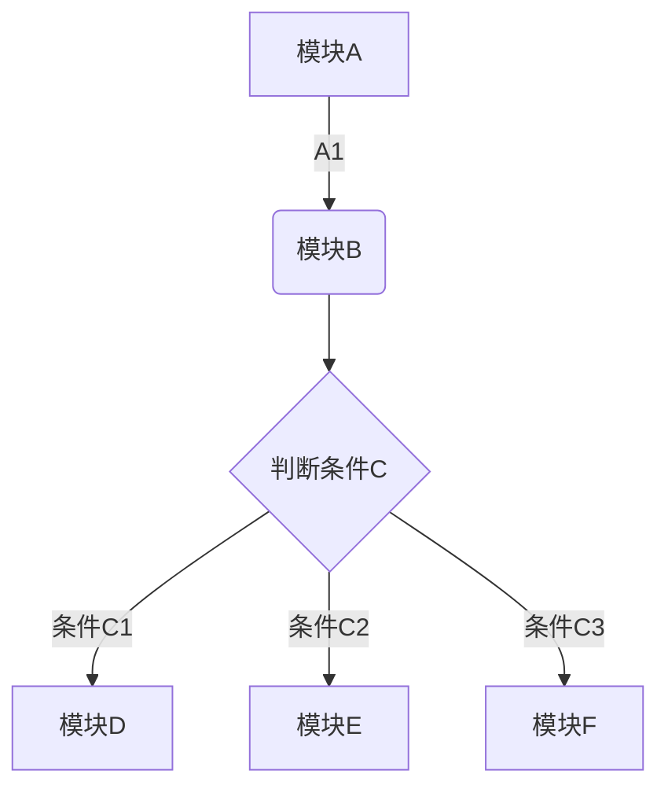

# 创建一个简单的spring容器
> spring管理bean的核心即：BeanDefinition、BeanFactory

* `BeanDefinition`：关于bean的描述，当前只定义了一个Object用于存放bean对象

* `BeanFactory`：创建bean的工厂类，通过beanName + BeanDefinition来创建对应的bean

* 类关系：  

```mermaid
graph TD
A[模块A] -->|A1| B(模块B)
B --> C{判断条件C}
C -->|条件C1| D[模块D]
C -->|条件C2| E[模块E]
C -->|条件C3| F[模块F]
```
