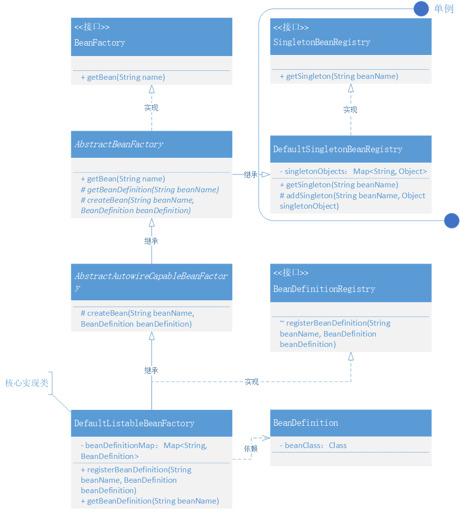

# 运用设计模式，实现 Bean 的定义、注册、获取
* `BeanDefinition`：关于bean的描述，目前定义了class属性存储
* `SingletonBeanRegistry`：单例Bnea注册接口，即定义获取单例bean的方法
* `BeanFactory`接口：定义了通用获取bean的方法
* `AbstractBeanFactory`抽象类：实现了获取bean的方法，定义获取BeanDefinition、创建bean的抽象方法
* `DefaultSingletonBeanRegistry`：将bean添加到单例池中，获取单例bean
* `AbstractAutowireCapableBeanFactory`抽象类：实现了创建bean的方法
* `BeanDefinitionRegistry`接口：定义注册BeanDefinition的方法
* `DefaultListableBeanFactory`：核心实现类，注册BeanDefinition、获取BeanDefinition

* 类关系：  

